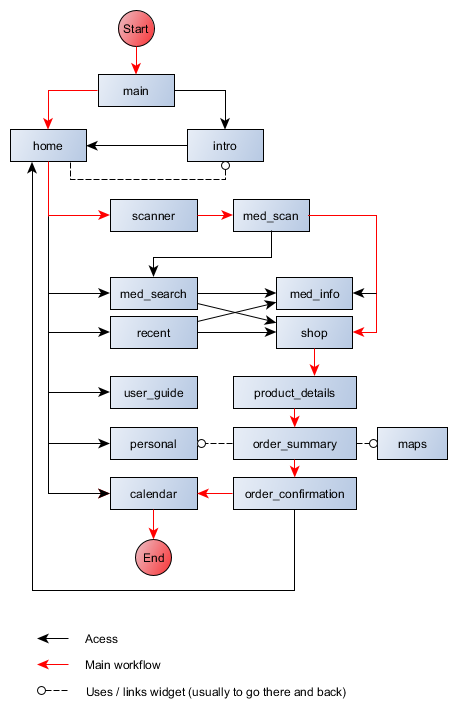

Mobile Applications for Public Health - Group 3

# Smart Apotheke

An app to conveniently pick a (German) medicament prescription, scan it, receive a list of scanned medicaments, order them to your home or specify a pharmacy to pick them up, and track medicament intake using a build-in calendar.

## Target system specifications

**Target operating system**: Android  
**Minimal Android SDK version**: 16 (Android 4.1)  
**Targeted Android SDK version**: 28 (Android 9.0)  
**Recommended hardware**: ~200 MB Storage, ~400 MB RAM  

## Development specifications

**Language**: Flutter 1.12.13+hotfix.5, Dart 2.7.0  
**IDE**: Visual Studio Code 1.41.1  

## Build release version

Run `flutter build apk --release` in the terminal of project's root folder to build a final executable package for Android. The file will be built into **build/app/outputs/apk/release/app-release.apk**. The app bundle includes Flutter's runtimes for ARM 32-bit, ARM 64-bit and Android 64-bit architectures.

## Technical documentation

The technical documentation was generated by Flutter's **dartdoc** tool https://github.com/dart-lang/dartdoc, and is located under project's root folder at **doc/api/index.html**. Unfortunately, **dartdoc** was initially developed to generate technical API documentations and, therefore, only includes comments made for public classes, functions and fields. We didn't want to break any naming conventions, so we kept some classes, functions and fields private as that is considered best practice by Flutter's development team https://flutter.dev/docs/development/ui/interactive#creating-a-stateful-widget. As stated in https://github.com/dart-lang/dartdoc/issues/664, Flutter's developers already consider to add a feature to include documentation for private instances in **dartdoc**.

## Folder and code structure

Since there are no set best practices on how to organize the code, we decided to split our code into 3 folders:

**lib/data**: includes globally accessible storage data (e.g. list of recent medicaments)  
**lib/util**: includes interface logic to some back-end data from the Internet, I/O of the settings, helper classes and other utilities  
**lib/widgets**: includes all user interfaces, calls **lib/util** classes and accesses **lib/data**  

## Workflow

The following workflow diagram shows all (ui) widget interconnections that can be accessed by the user. The red arrow line shows a possible workflow for the main use-case, where the user tries to scan a medicament prescription, order and add it to the calendar.

<!-- use  for dartdoc -->
<!-- use  for github -->

## Naming conventions

We decided to use the naming conventions promoted by Flutter's development team https://dart.dev/guides/language/effective-dart/style:

**File name**: snake-case (e.g. snake_case.dart)  
**Class**: upper-camel-case (e.g. ClassName)  
**Function**: lower-camel-case (e.g. functionName)  
**Class variable**: lower-camel-case (e.g. classVariableName)  

## Testing

Since most widgets and interface logic generate uncertain output, we developed a few unit tests for our utility files, that can be found in the **test** folder of the project's root folder.

